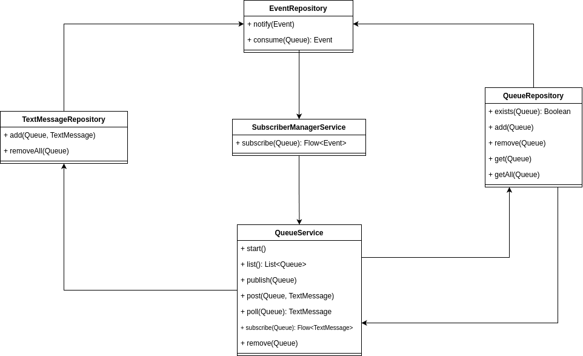

# Publish/Subscribe Service

## Introdução

Este trabalho visa a implementação de um serviço de filas de mensagens utilizando o protocolo gRPC para comunicação
entre cliente e servidor. Seus elementos principais são um servidor, que gerencia as filas de mensagens e seus 
inscritos, um cliente desenvolvido em Kotlin e um cliente desenvolvido em Python.
O processo de _build_ e gerenciamento de dependências dos módulos em Kotlin são realizados utilizando o Gradle.
A publicação do servidor e _build_ dos clientes podem ser realizados utilizando o Docker e através da tarefas
declaradas no Makefile na raiz do projeto.

## Dependências

- JDK 17
- Docker e Docker Compose
- Comando `make`
- Python 3.12

## Como executar

Todos módulos neste projeto podem ser executados através do Makefile na raiz do projeto, cada um com seu target.
Confira abaixo como cada um deles pode ser executado:

- Servidor: 
  - ```shell
    make server
    ```
  
- Cliente Kotlin: 
  - ```shell
    make client
    ```
  
- Cliente Python: 
  - ```shell
    make py_client
    ```

Note que o servidor deve ser executado antes dos clientes para o correto funcionamento dos clientes. Para alterar
a porta em que o servidor será executado, altere a variável `SERVER_PORT` para o valor desejato no arquivo 
`.env-sample` na raiz do projeto.

O contâiner do servidor é compilado através da imagem gerada pelo `Dockerfile` na raiz do módulo `server`, 
que utiliza as variáveis de ambiente do arquivo `.env-sample` na raiz do projeto. Por ser um projeto acadêmico,
o arquivo de exemplo foi utilizado para facilitar a execução do projeto.

Neste arquivo `.env-sample` também é possível alterar as credenciais do banco de dados, caso desejado.

## Arquitetura do projeto

Para chegar o mais próximo de uma aplicação de produção, adotamos uma estrutura de multi-módulos para cada um dos
módulos principais. Vamos detalhar cada um dos principais e de seus submódulos.

### Servidor

O servidor conta com 2 principais submódulos, `core` e `java-app`, onde o primeiro é responsável pela 
implementação da lógica de negócio necessária para que qualquer variante da aplicação funcione. Já o módulo `java-app`
possui apenas o que é necessário para uma aplicação Java nativa possa importar esta implementação e ser executada.

Dentro do módulo `core`, o submódulo `domain` possui o modelo das entidades de domínio da aplicação. Isto é, 
modelos que os serviços e casos de uso da aplicação iram utilizar para realizar suas tarefas. O submódulo
`service` contém apenas interfaces de domínio para serviços que deveram ser implementadas por algum componente 
de infraestrutura (que será detalhado nos próximos submódulos abordados). A proposta deste tipo de prática é facilitar
a alteração entre implementações, além de simplificar a implementação de testes unitários que dependem de alguma
implementação com este contrato.

Note que o submódulo `grpc` possui a implementação das interfaces de serviço definidas no submódulo `service`, 
utilizando o protocolo gRPC.

O submódulo `data` é um pouco mais complexo, mas de forma semelhante, o submódulo `repository` define as interfaces
de domínio que a aplicação pode utilizar para acessar algum modelo de dados. Enquanto o submódulo 
`database:postgres` possui a implementação desses repositórios baseado num banco de dados PostgreSQL.

Os submódulos restantes `test` e `util` são complementares e apenas definem ferramentas comuns a todos os submódulos
para testes e utilidades.

Note que o módulo `java-app` possui apenas um submódulo, `core`, pois nào é necessária nenhuma interação com o
usuário para termos uma camada de interface de usuário.

### Clientes

Os clientes, também com o intuito de termos aplicações parecidas com as de produção, possuem uma estrutura 
multi-módulos semelhante a do servidor. Elas contam com submódulos `core` e `java-app`, no caso do cliente em Kotlin, e 
apenas um arquivo `main.py` no caso do cliente Python.

O submódulo `core` do cliente Kotlin possui os mesmos submódulos do servidor, `domain`, `service`, `grpc` e `util`
com os mesmos propósitos. Como o cliente precisa de uma camada de interface de usuário, no módulo `java-app` temos
um submódulo `ui:cli`, que define as regras de interação entre o usuário, através da linha de comando e a
aplicação.

O cliente Python possui os mesmos submódulos do client Kotlin (exceto pelo `util`), pois tem uma implementação muito
parecida. A única diferença é não termos um módulo específico para a aplicação.

## Implementação

### Servidor

Todas essas operações do servidor são chamadas por algum processo remoto, acessado utilizando o protocolo gRPC. 
Para isso o ponto de entrada para estes processos está implementado na classe `QueueServiceGrpc`. Esta classe utiliza
implementa uma classe abstrata que é uma classe em Kotlin gerada pela
[biblioteca oficial](https://grpc.io/docs/languages/kotlin/quickstart/) do gRPC, responsável por abstrair
uma parte da implementação por meio de código gerado baseado nas definições do serviço definido no formato  
de Protocol Buffers.

Esta classe abstrata delega o que é executado em cada chamada via gRPC para a nossa implementação, que realiza
as operações dadas. As operações que o servidor é capaz de realizar são:

- Listagem de filas disponíveis
- Publicação de uma fila
- Postagem de uma (ou mais) mensagens em determinada fila
- Consulta da próxima mensagem de uma fila
- Inscrição de um cliente em uma fila
- Remoção de uma fila

Estas operações utilizam os repositórios de filas e mensagens para realizar as operações necessárias de salvamento
ou de remoção. Já as operações de consulta ou inscrição utilizam um repositório de eventos para notificar os inscritos
e as mensagens recebidas por eles.

Para atender a proposta de ter um servidor distribuído e resiliente em caso de falha da aplicação,
adotamos para o funcionamento do mesmo um paradigma de orientação a eventos. Isto é, 
para gerenciar os inscritos em uma fila, consulta-se num intervalo de tempo o repositório de eventos (`EventsRepository`)
para saber quando uma nova mensagem foi recebida ou quando uma fila foi removida, por exemplo. A escuta dos eventos
é feita via um serviço que gerencia os inscritos (`SubscriberManagerService`),
tendo um _job_ (que seria um bloco de código assíncrono que é executado numa corrotina) por fila
observando eventos de uma fila que foram gerados.

A cada inscrição, é retornado um `Flow` onde são emitidos eventos de determinada fila, de acordo com seu tipo.
Então, o serviço gerenciador de inscritos mantém um escopo de emissão (`ProducerScope`) para cada inscrito e para cada fila,
sendo possível definir pelo tipo de fila se todos ou apenas um dos inscritos precisam ser notificados de um evento.
Note que a estratégia para seleção do inscrito no caso de uma fila simples é aleatória, neste momento.

A criação e remoção de filas, assim como a postagem de mensagens, é feita pelos seus devidos repositórios, 
`QueueRepository` e `TextMessageRepository`. Porém, dado o paradigma adotado para a aplicação,
estes repositórios recebem uma instância do repositório de eventos. Este repositório foi definido de
modo que a notificação de eventos precisa ocorrer na mesma transação que a instrução que gera o evento em si.

Vale destacar que, para manter o isolamento de cada domínio, cada domínio da aplicação possui seus próprios modelos
mapeados através das extensões contidas nos arquivos com sufixo `Mapper`. Por exemplo, existe um mapeamento de 
modelos de domínio quando há o salvamento de uma fila, tanto do formato de fila do domínio do servidor, quanto para
o formato de fila do domínio do banco de dados. O mesmo ocorre para a troca entre cliente e servidor, onde os modelos
são únicos para cada um deles.

Por exemplo, ao postar uma mensagem, ela precisa ser salva no banco para manter a resiliência em caso
de queda da aplicação do servidor. Tanto o salvamento da mensagem quanto o salvamento do evento a ser notificado
precisa ocorrer na mesma transação do banco de dados, para que, em caso de falha de alguma das operações, não
tenhamos um evento ou uma notificação inconsistentes entre si.

Da mesma forma, durante o consumo de eventos, tanto a busca dos dados do evento a ser consumido, quanto a remoção dos
objetos envolvidos (remoção da mensagem a ser enviada, por exemplo), também são realizadas numa única transação do 
banco de dados.

Dito isso, a relação entre as classes mencionadas acima seria:



### Clientes

Os clientes, tanto em Kotlin quanto em Python, possuem uma estrutura de código semelhante. Ambos também utilizam 
códigos gerados pela biblioteca da gRPC para Kotlin e Python, respectivamente. A diferença entre eles é que os clientes
utilizam classes destinadas à implementação dos clientes gRPC.

O funcionamento dos clientes é interativo via linha de comando. Os clientes executam um laço onde o usuário seleciona 
uma das operações para ser realizada ou encerra a aplicação. É importante ressaltar que os eventos que necessitam
de uma fila específica primeiro enviam uma requisição de listagem de filas para que o usuário selecione
em qual fila a operação deve ser executada.

Quando um cliente se inscreve em alguma das filas, as mensagens são recebidas e exibidas na tela 
até que o usuário cancele a operação pressionando a tecla `Enter`.

## Cobertura de testes
